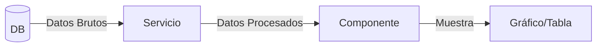
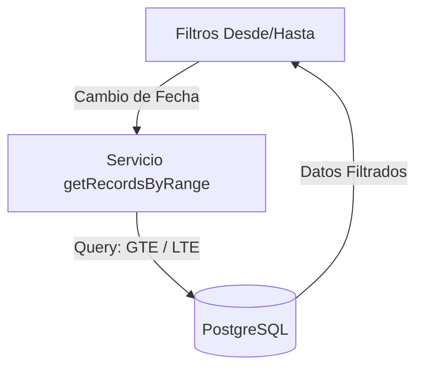
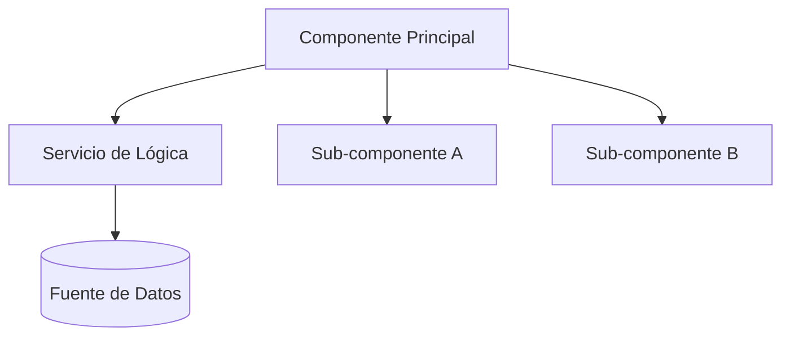

# Skill: Factorización Modular de Aplicaciones (factorization-app)

Esta guía define el estándar de oro para construir y refactorizar módulos en cualquier proyecto, garantizando que el código sea legible, testeable y fácil de mantener.

## 1. Separación de Responsabilidades

### El Servicio (`src/services/`)
- **Responsabilidad**: Consultas a APIs o Bases de Datos, validación de reglas de negocio, formateo y transformación de datos brutos.
- **Ventaja**: Permite reutilizar la lógica de negocio en cualquier parte de la aplicación sin depender de la UI.

### El Componente Orquestador (`Tab` o `Page`)
- **Responsabilidad**: Manejar estados globales del módulo, coordinar sub-componentes y gestionar efectos secundarios (suscripciones, carga inicial).
- **Meta**: Mantener el archivo por debajo de 300 líneas de código delegando responsabilidades de renderización.

### El Sub-componente Atómico
- **Responsabilidad**: Renderizar una parte específica de la UI (ej: tabla, buscador, detalle de item).
- **Relación**: Debe ser puramente visual o controlado por `props`, evitando lógica de negocio pesada.

## 2. Patrón Recomendado: Pipeline de Datos
Para módulos de analítica o flujos complejos, siga este orden:
1.  **Fetch**: El Servicio obtiene datos brutos (Raw Data) de la fuente.
2.  **Process**: El Servicio transforma, filtra o agrupa los datos (Processed Data).
3.  **Consume**: El Componente UI recibe los datos ya listos para `recharts` o tablas.

## 3. Paginación Semántica (Rangos de Fecha)
Para módulos con alto volumen de datos transaccionales, **no use paginación numérica** (Siguiente/Atrás) por defecto. Use el patrón de **Rango de Fechas**:

### ¿Por qué?
- **Control del Usuario**: El usuario sabe qué periodo busca (ej. "las ventas de ayer").
- **Rendimiento**: Limita el conjunto de datos en la base de datos de forma natural y predecible.
- **Simplicidad**: Menos estado en la UI que manejar (no se necesitan botones de página).

### Implementación
1.  **Estado**: Mantenga `dateFrom` y `dateTo` en el componente principal.
2.  **Servicio**: Use `.gte()` y `.lte()` en las consultas de Supabase.
3.  **UI**: Proporcione dos inputs de fecha claros ("Desde" / "Hasta").

## 4. Diagrama de la Arquitectura

## 3. Checklist de Calidad Técnica
- [ ] ¿La lógica de persistencia está separada de la interfaz gráfica?
- [ ] ¿El archivo tiene menos de 300 líneas?
- [ ] ¿Los componentes comparten interfaces claras mediante Props?
- [ ] ¿Es fácil testear la lógica de negocio sin montar ningún componente de UI?

Siguiendo este estándar, cualquier proyecto nuevo será mantenible a largo plazo, sin importar su complejidad crezca.
